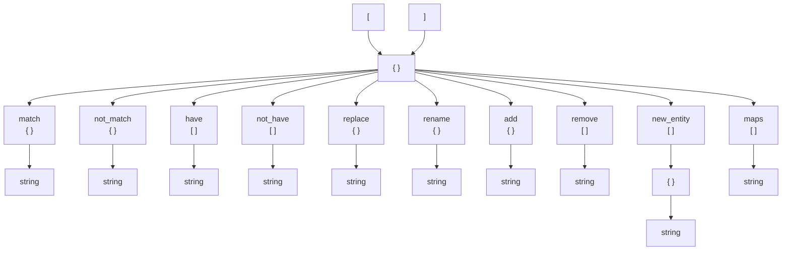

| #Trans |
|---|
| [English](#en) |
| [Español](#es) |

# EN

<span style="color:rgb( 255, 255, 0 );">

### ripent.py is a utility for goldsource BSP maps.

#### This tool allows modifying the structure of entities massively through a configuration.

</span>

- <span style="background-color:rgb( 60, 50, 0 );">This script is heavily inspired by [lazyripent.py](https://github.com/Zode/lazyripent)</span>


## <span style="color:rgb( 0, 150, 255 );">Special Thanks to:</span>

- [Zode](https://github.com/Zode)
- omamfan
- Erty

---
> NOTE: <span style="color:rgb( 255, 0, 0);"> It is recommended to use a decent program if you are not familiar with JSON, as these will show you your errors if you make any. [Visual Studio Code](https://code.visualstudio.com/) is recommended.</span>

---

# <span style="color:rgb( 255, 255, 0 );">rules.json</span>

The JSON format we will use is composed of an array of dictionaries

```json
[
    { },
    { },
    { }
]
```

Each dictionary represents a rule to be applied to the map entities.

There are two types of rules: selectors and actions.

While selectors are responsible for "choosing" entities, actions are responsible for executing certain actions if they were chosen.



---

# <span style="color:rgb( 255, 0, 0 );">Selectors</span>

### <span style="color:rgb( 0, 255, 0 );">match</span>

```json
"match":
{
    "classname": "monster_barney",
    "models": "models/barney2.mdl"
}
```
The entity MUST have the following values defined.

### <span style="color:rgb( 0, 255, 0 );">not_match</span>

```json
"not_match":
{
    "weapons": "1"
}
```
The entity MUST NOT have the following values defined.

> NOTE: match and not_match are special and support initial and final wildcarding with an asterisk <span style="color:rgb( 0, 255, 0 );">*</span>

### <span style="color:rgb( 0, 255, 0 );">have</span>

```json
"have":
[
    "body",
    "skin"
]
```
The entity MUST have these keys, regardless of their value.

### <span style="color:rgb( 0, 255, 0 );">not_have</span>

```json
"not_have":
[
    "spawnflags"
]
```
The entity MUST NOT have these keys, regardless of their value.

### <span style="color:rgb( 0, 255, 0 );">maps</span>

```json
"maps":
[
    "c1a0",
    "c1a1"
]
```
The map MUST be named one of these.

# <span style="color:rgb( 255, 0, 0 );">Actions</span>

### <span style="color:rgb( 0, 255, 0 );">replace</span>

```json
"replace":
{
    "models": "models/mymod/barney.mdl"
}
```
Replaces the value of a key.

### <span style="color:rgb( 0, 255, 0 );">rename</span>

```json
"rename":
{
    "body": "bodygroup"
}
```
Renames the key while keeping the original value.

### <span style="color:rgb( 0, 255, 0 );">rename</span>

```json
"add":
{
    "weapons": "1"
}
```
Adds a new key-value pair.

### <span style="color:rgb( 0, 255, 0 );">rename</span>

```json
"remove":
[
    "skin"
]
```
Removes the key and its value.

### <span style="color:rgb( 0, 255, 0 );">rename</span>

```json
"new_entity":
[
    {
        "classname": "env_sprite_follow",
        "target": "$targetname"
    }
]
```
Creates one or more new entities.

---
### <span style="color:rgb( 0, 255, 0 );">maintain values</span>
In some cases, you can use a dollar sign <span style="color:rgb( 0, 255, 0 );">$</span> at the beginning to copy the original value of the entity.

> For example: <span style="color:rgb( 0, 255, 0 );">"body": "$bodygroup"</span>

In this case, we are copying the existing value in the "bodygroup" key.

---

# ES

<span style="color:rgb( 255, 255, 0 );">

### ripent.py es una utilidad para los mapas BSP de goldsource.

#### Esta herramienta permite modificar la estructura de las entidades masivamente mediante una configuración.

</span>

- <span style="background-color:rgb( 60, 50, 0 );">Este script esta fuerte mente inspirado en [lazyripent.py](https://github.com/Zode/lazyripent)</span>


## <span style="color:rgb( 0, 150, 255 );">Agradecimientos especiales a:</span>

- [Zode](https://github.com/Zode)
- omamfan
- Erty

---

> NOTA:<span style="color:rgb( 255, 0, 0);"> Es recomendable usar un programa decente si no estas relacionado a json, ya que estos van a enseñarte tus errores, si cometes alguno. Se recomienda [Visual Studio Code](https://code.visualstudio.com/)</span>

---

# <span style="color:rgb( 255, 255, 0 );">rules.json</span>

El formato de json que utilizaremos esta compuesto de una array de diccionarios

```json
[
    { },
    { },
    { }
]
```

Cada diccionario representa una regla a aplicar a las entidades del mapa.

Existen dos tipos de reglas los selectores y las acciones.

Mientras que los selectores se encargan de "escoger" entidades las acciones se encargan de ejecutar ciertas acciones si fueron escogidas.


---

# <span style="color:rgb( 255, 0, 0 );">Selectores</span>

### <span style="color:rgb( 0, 255, 0 );">match</span>

```json
"match":
{
    "classname": "monster_barney",
    "models": "models/barney2.mdl"
}
```
La entidad DEBE tener los siguientes valores definidos.

### <span style="color:rgb( 0, 255, 0 );">not_match</span>

```json
"not_match":
{
    "weapons": "1"
}
```
La entidad NO DEBE tener los siguientes valores definidos.

> NOTA: match y not_match son especiales y soportan wildcarding inicial y final con un asterisco <span style="color:rgb( 0, 255, 0 );">*</span>

### <span style="color:rgb( 0, 255, 0 );">have</span>

```json
"have":
[
    "body",
    "skin"
]
```
La entidad DEBE tener estas keys, no importa su valor.

### <span style="color:rgb( 0, 255, 0 );">not_have</span>

```json
"not_have":
[
    "spawnflags"
]
```
La entidad NO DEBE tener estas keys, no importa su valor.

### <span style="color:rgb( 0, 255, 0 );">maps</span>

```json
"maps":
[
    "c1a0",
    "c1a1"
]
```
El mapa DEBE llamarse igual a uno de estos.

# <span style="color:rgb( 255, 0, 0 );">Acciones</span>

### <span style="color:rgb( 0, 255, 0 );">replace</span>

```json
"replace":
{
    "models": "models/mymod/barney.mdl"
}
```
Reemplaza el valor de una key.

### <span style="color:rgb( 0, 255, 0 );">rename</span>

```json
"rename":
{
    "body": "bodygroup"
}
```
Cambia el nombre de la key manteniendo el valor original.

### <span style="color:rgb( 0, 255, 0 );">rename</span>

```json
"add":
{
    "weapons": "1"
}
```
Añade una key-value nueva.

### <span style="color:rgb( 0, 255, 0 );">rename</span>

```json
"remove":
[
    "skin"
]
```
Elimina el valor y la key.

### <span style="color:rgb( 0, 255, 0 );">rename</span>

```json
"new_entity":
[
    {
        "classname": "env_sprite_follow",
        "target": "$targetname"
    }
]
```
Crea una o varias entidades nuevas.

---

### <span style="color:rgb( 0, 255, 0 );">mantener valores</span>
En algunos casos puedes utilizar un signo de dolar <span style="color:rgb( 0, 255, 0 );">$</span> al inicio para copiar el valor original de la entidad.

> por ejemplo: <span style="color:rgb( 0, 255, 0 );">``"body": "$bodygroup"``</span>

En este caso estamos copiando el valor existente en la key "bodygroup"

---
