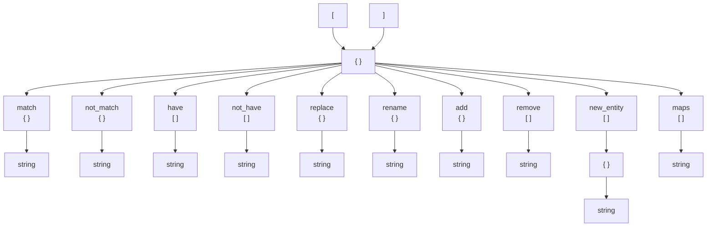

# Discontinued

Use [LazyRipent2](https://github.com/Zode/Lazyripent2) instead, offers the same features as this does over Lazyripent 1 but it's written in C#

# About

ripent.py is a python script for exporting, importing and modifying entity data by using logic rules

This is heavily inspired in [lazyripent.py](https://github.com/Zode/lazyripent)

[](https://github.com/Mikk155/ripent.py/actions/workflows/build.yaml)

# Installing

- [windows](https://github.com/Mikk155/ripent.py/releases/download/1.0.0/ripent.exe) (1.0.0)
    - It may be threated as malware due to python being repacked within the executable
    - It is trustful, you can see the [workflows](https://github.com/Mikk155/ripent.py/actions) where it is built
    - If you still have your doubts you can always install python and use the open-source library

- [python](https://github.com/Mikk155/ripent.py/releases/download/2.0/ripent.py) (2.0)
    - Requires library [MikkUtils](https://github.com/Mikk155/MikkUtils) >= 0.0.4
    > ```
    > pip install MikkUtils
    > ```

- [linux](https://github.com/Mikk155/ripent.py/releases/download/1.0.0/ripent) (1.0.0)
    - Probably the same as windows executable
    - This [workflows](https://github.com/Mikk155/ripent.py/actions) program has not been tested yet so i'm unsure if this even works

- rules
    - This is a example rules made for another project that is using this tool

# Using

Run the script and follow the instructions or use it in with arguments for advanced mode

## Advanced mode

# Logic Rules

---
> NOTE: It is recommended to use a decent program if you are not familiar with JSON, as these will show you your errors if you make any. [Visual Studio Code](https://code.visualstudio.com/) is recommended.
---

The JSON format we will use is composed of an array of dictionaries

Each dictionary represents a rule to be applied to the map entities.

There are two types of rules: selectors and actions.

While selectors are responsible for "choosing" entities, actions are responsible for executing certain actions if they were chosen.



## Selectors

### match

```json
"match":
{
    "classname": "monster_barney",
    "models": "models/barney2.mdl"
}
```
The entity MUST have the following values defined.

### not_match

```json
"not_match":
{
    "weapons": "1"
}
```
The entity MUST NOT have the following values defined.

### maps

```json
"maps":
[
    "c1a0",
    "c1a1"
]
```
The map MUST be named one of these.

> NOTE: maps, match and not_match are special and support initial and final wildcarding with an asterisk ``*``

### have

```json
"have":
[
    "body",
    "skin"
]
```
The entity MUST have these keys, regardless of their value.

### not_have

```json
"not_have":
[
    "spawnflags"
]
```
The entity MUST NOT have these keys, regardless of their value.

## Actions

### delete

```json
"delete": true
```
Deletes the entity

### replace

```json
"replace":
{
    "models": "models/mymod/barney.mdl"
}
```
Replaces the value of a key.

### rename

```json
"rename":
{
    "body": "bodygroup"
}
```
Renames the key while keeping the original value.

### add

```json
"add":
{
    "weapons": "1"
}
```
Adds a new key-value pair.

### remove

```json
"remove":
[
    "skin"
]
```
Removes the key and its value.

### new_entity

```json
"new_entity":
[
    {
        "classname": "env_sprite_follow",
        "target": "$targetname"
    }
]
```
Creates one or more new entities.

---
### values
In some cases, you can use a dollar sign ``$`` at the beginning to copy the original value of the entity.

> For example: ``"body": "$bodygroup"``

In this case, we are copying the existing value in the "bodygroup" key.

That feature works for the values of:
- new_entity
- replace
- add

# Credits

- [Zode](https://github.com/Zode)

- omamfan

- [Erty](https://github.com/Erty-Gamedev)
